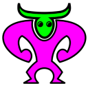

# webchummer
A Shadowrun compatible Character Generator running in your browser

# License
This project is licensed under the [MIT License](LICENSE), where not otherwise stated.

The "`webchummer` Logo",  
is adapted from ["Minotaur Icon"](https://game-icons.net/1x1/lorc/minotaur.html) by [Lorc](https://lorcblog.blogspot.com/), used under [CC BY 3.0](https://creativecommons.org/licenses/by/3.0/),  
and ["Triton head icon"](https://game-icons.net/1x1/lorc/triton-head.html) by [Lorc](https://lorcblog.blogspot.com/), used under [CC BY 3.0](https://creativecommons.org/licenses/by/3.0/). 

The "`webchummer` Logo" is licensed under [CC BY 3.0](https://creativecommons.org/licenses/by/3.0/) by [Jan-Ka](https://github.com/Jan-Ka).
